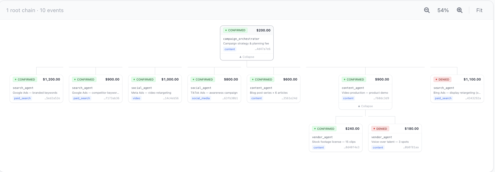

# FiGuard

**Pre-flight spend authorization for AI agents.**  
Your agent asks permission before money moves. FiGuard says yes or no — and keeps a complete audit trail either way.

[](https://github.com/figuard/figuard-core/actions/workflows/ci.yml)
[](LICENSE)
[](https://pypi.org/project/figuard/)
[&color=cb3837)](https://www.npmjs.com/package/figuard)
[](https://www.npmjs.com/package/figuard-mcp)

---

## The Problem

```python
# Without FiGuard — the agent decides to spend
for item in purchases:
    stripe.charge(item["amount"])  # all three go through — no gates, no record
```

```python
# With FiGuard — authorize before anything moves
for item in purchases:
    auth = client.authorize(
        session_token=session_token,
        agent_id="travel_agent",
        action_type="PURCHASE",
        description=item["description"],
        requested_quantity=item["amount"],
        claimed_category=item["category"],
        idempotency_key=item["key"],
    )
    if auth.is_authorized:
        stripe.charge(auth.approved_quantity)
        client.confirm_event(auth.event_id, confirmed_quantity=auth.approved_quantity)
    else:
        log.warning("Blocked: %s — %s", item["description"], auth.denial_reason)

# ✓ flight:    AUTHORIZED — $267.00 charged
# ✗ insurance: DENIED     — NO_MATCHING_ALLOCATION
# ✓ hotel:     AUTHORIZED — $198.00 charged
```

The difference: **authorization happens before the transaction, not after.**  
Denied decisions are recorded in the ledger regardless. The agent always gets a structured, machine-readable response.

---



---

## How It Works

```
  Developer
  ──────────▶ create budget ──▶ session token issued to agent
              ($500 USD  or  100k tokens  or  any unit)
                        │
           ┌────────────┴────────────────────────────┐
           │                                         │
     single agent                            fleet agent
           │                          issue delegation tokens
           │                          ├─▶ sub-agent A ($3k refunds)
           │                          └─▶ sub-agent B ($5k compute)
           │                                         │
           └────────────┬────────────────────────────┘
                        │
              ┌─────────┴──────────┐
        monetary budget      resource budget
        currency: "USD"      unit: "tokens"
              └─────────┬──────────┘
                        │
                        ▼
  authorize()    ← nothing has moved yet
  checks: limit · category · expiry · anomaly · dedup
                        │
           ┌────────────┴────────────┐
        AUTHORIZED               DENIED
        funds reserved         nothing moves
           │                   structured denial code
           ▼
  [agent executes action]
  payment / API call / compute
           │
  ┌────────┼────────┐
succeeds  fails  cancelled
   │        │        │
confirm() fail()  void()
qty spent released released
   └────────┴────────┘
                        │
                        ▼
        ┌───────────────────────────────────┐
        │  every decision recorded in the   │
        │  append-only ledger — authorized, │
        │  denied, confirmed, failed, voided│
        └───────────────────────────────────┘
```

---

## 60-Second Quickstart

**1. Point at the sandbox**

```bash
pip install figuard
```

```python
from figuard import FiGuardClient

client = FiGuardClient(
    api_key="sb_live_demo",
    base_url="https://figuard-sandbox-1.onrender.com",
)
```

No setup required. The sandbox is a live FiGuard instance with a preloaded demo key.

**2. Create a budget and authorize a spend**

```python
budget = client.create_budget(
    user_id="agent_001",
    total_limit=500.00,
    currency="USD",
    expires_in="24h",
    authorization_expiry_seconds=300,
    intent_context="travel booking session",
)

# budget.tokens is a list — one entry per dimension so agents have full context
# on all spending dimensions for this user. For simple budgets: one entry with
# category="default". Use primary_token as a convenience accessor.
auth = client.authorize(
    session_token=budget.primary_token.session_token,
    agent_id="travel_agent",
    action_type="PURCHASE",
    description="JetBlue SFO→JFK roundtrip",
    requested_quantity=270.00,
    idempotency_key="booking-001",
)

print(auth.decision)          # AUTHORIZED
print(auth.approved_quantity) # 270.0

# Confirm with actual charged amount after the transaction succeeds
client.confirm_event(auth.event_id, confirmed_quantity=267.00)
```

**3. Self-host** — [see self-hosting docs](docs/self-hosting.md)

```bash
git clone https://github.com/figuard/figuard-core
cd figuard-core && make run
# Ready at http://localhost:8080

# Optional: run the dashboard in a separate terminal
make dashboard
# Dashboard at http://localhost:5173
```

Verify it's working in one line:

```bash
curl -s -H "X-Agent-Budget-Key: sb_live_demo" \
  http://localhost:8080/api/v1/budgets
# {"content":[],"totalElements":0,...}
```

Run the example scenarios:

```bash
pip install figuard anthropic
python examples/rogue_agent_scenarios/scenario_1_infinite_loop.py
```

---

## Create Your First Policy

Pick your scenario in the interactive wizard — monetary vs non-monetary budget, single agent vs fleet, per-category limits, safety controls — and get the exact `create_budget` + `authorize` calls ready to paste.

**[→ Open the code wizard](https://figuard.io/#get-started)**

Or follow the decision tree in [Pick your pattern](docs/pick-your-pattern.md) if you prefer plain docs. Full parameter reference in [Budget configuration](docs/budget-configuration.md).

---

## What FiGuard Is Not

**Not a payment processor.** FiGuard never touches money. It authorizes the intent to spend and records the decision. The actual payment goes through your existing processor as before.

**Not a policy language.** Budget limits and allocation caps are structured data, not a DSL. FiGuard matches the category an agent declares against the categories you defined — nothing more.

**Not a firewall for human users.** FiGuard is purpose-built for agent-to-service authorization. The session token model assumes agents are ephemeral and untrusted by default.

**Not a replacement for Stripe spending controls.** Use both if you want defense in depth. FiGuard blocks at agent decision time; Stripe blocks at payment time. Different attack surfaces.

---

## Why Not Build It Yourself?

You could. The authorize endpoint looks simple — check the balance, write a record. But the parts that matter are the parts that aren't obvious until you've hit them in production:

**Concurrent authorization** — two agents sharing a budget can both read the same available balance, both see enough funds, and both get approved. By the time the second write lands, you're over limit. The fix is a pessimistic write lock on the budget row during authorization. Easy to know, easy to forget.

**Dangling reservations** — a network timeout between the authorization write and the HTTP response leaves the agent with no event ID and the budget with a reserved amount it can't release. You need idempotency keyed to the request, not the response, so a retry finds the original authorization instead of creating a second one.

**The reservation/confirmation split** — if you use a single `amountSpent` field and deduct at authorization time, two concurrent authorizations both read the same balance before either writes. The correct model is two fields: `amountReserved` (deducted at authorization) and `amountSpent` (moved from reserved at confirmation). This is the two-phase reserve-then-capture pattern that payment processors use. It's not novel — it's just usually hidden inside Stripe.

**Session token security** — you need a token that scopes to exactly one budget, is returned exactly once, and is never stored in plaintext. If you store the raw token and your database is breached, every active agent session is compromised. Hash at write time, never store the raw value.

**Append-only ledger** — a mutable status field on an authorization record loses history. When you need to reconstruct what happened and why a budget hit its limit, you want every state transition recorded as a separate row, not an update to the previous one.

None of this is architecturally exotic. It's the same set of problems that payment infrastructure teams solved 20 years ago. FiGuard is that infrastructure applied to agent systems — already built, already tested, already handling the edge cases.

---

## Docs

- **Interactive API docs:** http://localhost:8080/swagger-ui.html (local) · https://sandbox.figuard.io/swagger-ui.html (live sandbox)
- [API Reference](docs/api-reference.md) — full endpoint reference with payloads
- [Pick Your Pattern](docs/pick-your-pattern.md) — decision tree: find your scenario, get the exact create + authorize calls
- [Budget Configuration](docs/budget-configuration.md) — full parameter reference for all four configuration layers
- [Framework Integrations](docs/integrations.md) — LangChain, CrewAI, OpenAI Agents SDK, Anthropic
- [Fleet Agents & Delegation Tokens](docs/fleet-agents.md)
- [Enforcement Features](docs/enforcement.md) — denial codes, anomaly detection, allocation modes
- [Replay & Audit](docs/replay.md)
- [TypeScript SDK](docs/typescript-sdk.md)
- [MCP Server](docs/mcp-server.md)
- [Self-Hosting](docs/self-hosting.md)
- [Known Limitations](docs/known-limitations.md)

## Examples

### Agent Failure Scenarios

Five real failure modes — each a runnable Python file plus an interactive Colab notebook.

| # | Scenario | FiGuard stops it at | Colab |
|---|----------|---------------------|-------|
| 1 | **Infinite quality loop** — 847 iterations, $16.94, no alert | iteration 251, $5.00 budget ceiling | [](https://colab.research.google.com/github/figuard/figuard-notebooks/blob/main/agent-incidents/01_infinite_loop.ipynb) |
| 2 | **Duplicate invoice payment** — timeout + retry = double charge | retry returns same event_id, one charge | [](https://colab.research.google.com/github/figuard/figuard-notebooks/blob/main/agent-incidents/02_duplicate_payment.ipynb) |
| 3 | **Concurrent fleet overspend** — 10 agents, 1 budget, $2k attempted | 5 authorized, 5 denied, $1k never exceeded | [](https://colab.research.google.com/github/figuard/figuard-notebooks/blob/main/agent-incidents/03_concurrent_overspend.ipynb) |
| 4 | **Rogue sub-agent** — one hallucinating agent drains the whole fleet | delegation cap stops researcher at $200, fleet completes | [](https://colab.research.google.com/github/figuard/figuard-notebooks/blob/main/agent-incidents/04_rogue_subagent_fleet.ipynb) |
| 5 | **Category violation** — hotel charged to flight budget, found at month-end | `DENIED — CATEGORY_MISMATCH` at authorization time | [](https://colab.research.google.com/github/figuard/figuard-notebooks/blob/main/agent-incidents/05_category_violation.ipynb) |

Source: [`examples/rogue_agent_scenarios/`](examples/rogue_agent_scenarios/)

## SDKs

| SDK | Install |
|---|---|
| Python | `pip install figuard` |
| TypeScript / Node.js | `npm install figuard` |
| MCP Server | `npx figuard-mcp` |
| Java | `com.figuard:figuard-sdk` |

---

## Roadmap

### V2
- **Row Level Security** — PostgreSQL RLS policies as a second enforcement layer for operators running FiGuard in shared multi-tenant mode
- **Velocity counter table** — replace live `COUNT`/`SUM` queries with an atomically-incremented counter table per budget per window, removing the `spend_events` scan from the authorize hot path

### V3
- **Redis velocity counters** — sliding-window counters in Redis, eliminating the DB round-trip for velocity checks at high throughput
- **Helm chart** — production-grade Kubernetes deployment with configurable replicas, resource limits, and secret management

---

## Contributing

Issues, PRs, and integration requests welcome.

- [Contributing guide](CONTRIBUTING.md)
- [Good first issues](https://github.com/figuard/figuard-core/labels/good-first-issue)
- [GitHub Discussions](https://github.com/figuard/figuard-core/discussions)

Looking for contributors on: Go SDK · LlamaIndex integration · DSPy integration · Helm chart

---

## License

Apache 2.0 — see [LICENSE](LICENSE).
